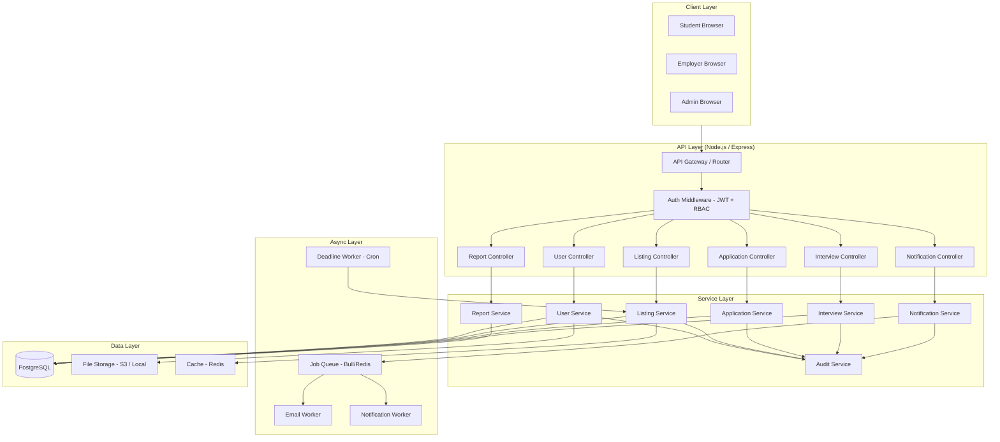
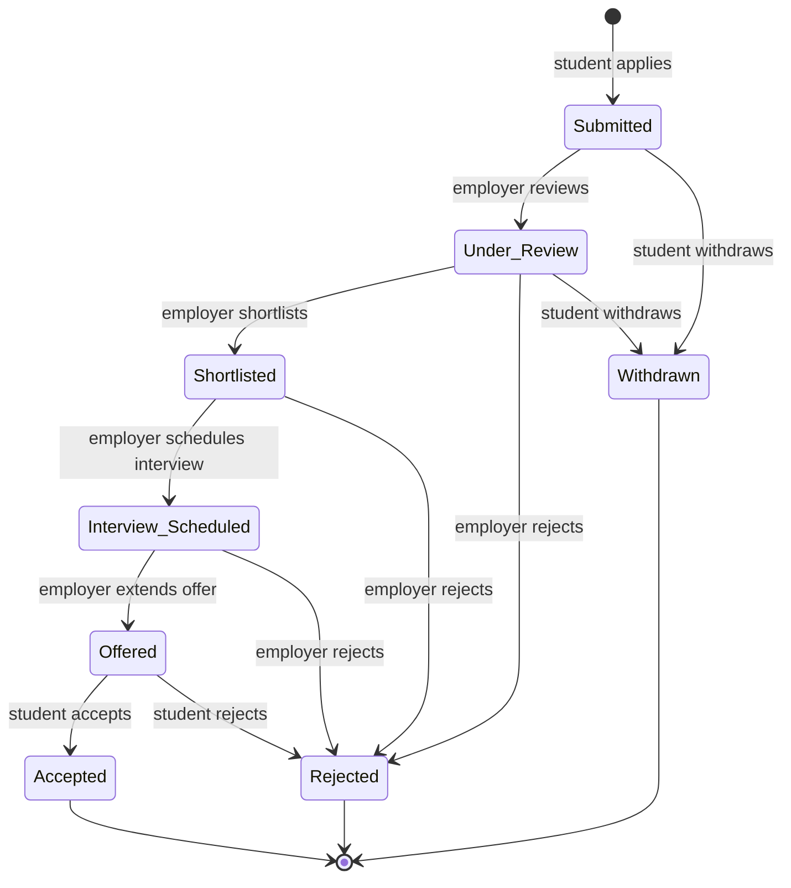
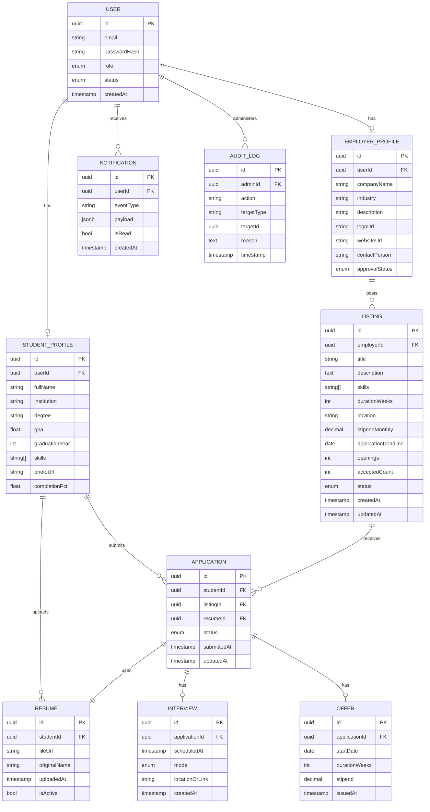
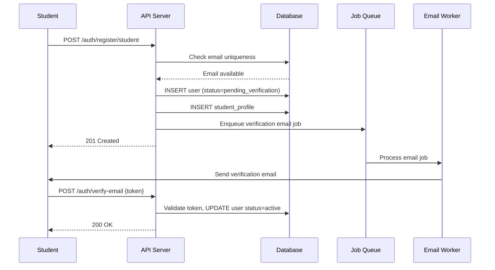
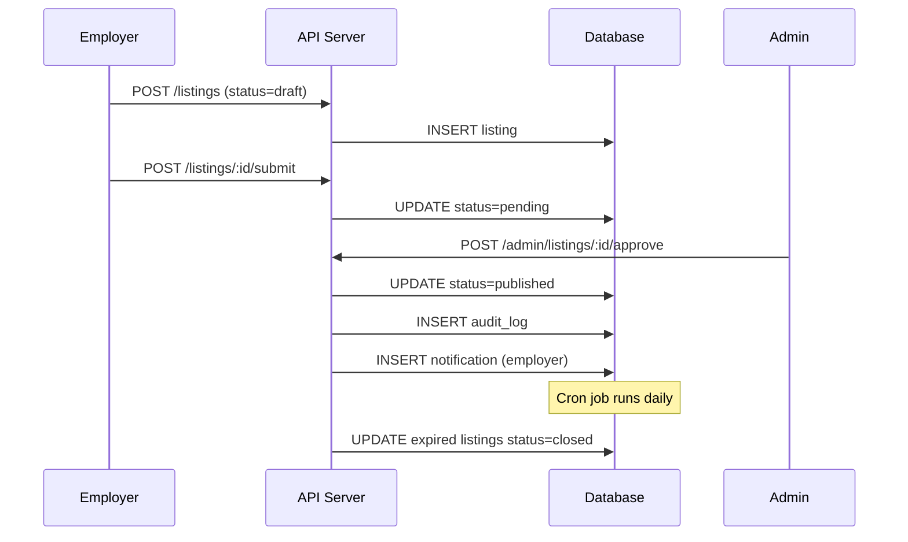
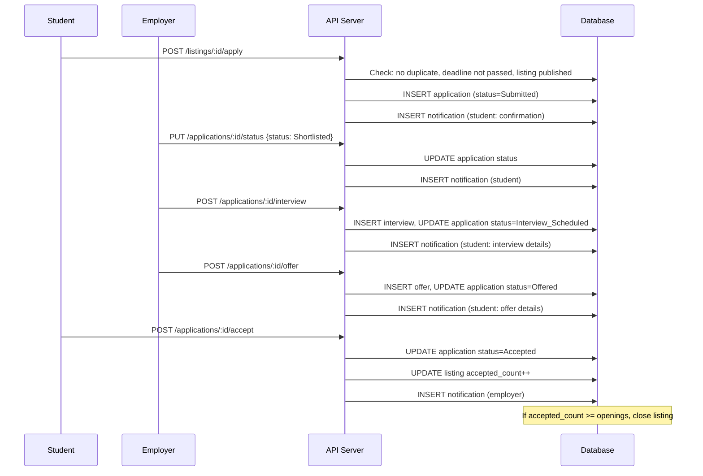

# Design Document: Internship Portal Management System

## Overview

The Internship Portal Management System is a three-tier web application that facilitates the complete internship lifecycle across three actor roles: **Students**, **Employers**, and **Administrators**. The platform covers account registration and authentication, profile management, internship listing creation and discovery, application submission and tracking, interview scheduling, offer management, notifications, and analytics/reporting.

The design prioritises a clean separation of concerns between the frontend presentation layer, a RESTful API backend, and a relational database. Role-based access control (RBAC) is enforced at the API layer. All asynchronous work — emails, notifications, and deadline enforcement — is delegated to a background job queue to keep request latency low.

Key design goals:
- **Correctness**: Every state transition in the application lifecycle is validated server-side.
- **Security**: Authentication uses stateless JWT tokens with short expiry; sensitive endpoints are guarded by RBAC middleware.
- **Extensibility**: Notification delivery and report generation are abstracted behind interfaces so new channels (SMS, push) can be added without touching core logic.
- **Auditability**: All moderation actions are written to an immutable audit log.

---

## Architecture

The system follows a standard three-tier architecture with an asynchronous job layer for background processing.



### Architectural Decisions

| Decision | Choice | Rationale |
|---|---|---|
| API style | REST + JSON | Straightforward, widely understood, tooling-rich |
| Auth mechanism | JWT (access token 15 min + refresh token 7 days) | Stateless, scalable; refresh flow handles idle-session termination |
| Database | PostgreSQL | Strong relational integrity for the complex status-machine; JSONB available for flexible fields |
| Background jobs | Bull + Redis | Reliable queue with retry semantics for email and notifications |
| File storage | S3-compatible object storage | Decouples files from app servers; supports CDN fronting |
| Cache | Redis | Session blacklist, rate-limit counters, listing search cache |

---

## Components and Interfaces

### 1. Authentication Module

Responsible for registration, login, email verification, password reset, token refresh, and session termination.

**Key interfaces:**

```typescript
interface AuthService {
  register(dto: RegisterDTO): Promise<User>;
  verifyEmail(token: string): Promise<void>;
  login(email: string, password: string): Promise<TokenPair>;
  refreshToken(refreshToken: string): Promise<TokenPair>;
  requestPasswordReset(email: string): Promise<void>;
  resetPassword(token: string, newPassword: string): Promise<void>;
  logout(userId: string, refreshToken: string): Promise<void>;
}

interface TokenPair {
  accessToken: string;   // JWT, 15-minute expiry
  refreshToken: string;  // opaque token, 7-day expiry, stored in DB
}
```

Account lockout is tracked in Redis (`lockout:{userId}` with a 15-minute TTL). Idle-session termination is handled client-side by detecting access token expiry without a valid refresh token after 30 minutes of inactivity; the refresh token record is invalidated server-side.

---

### 2. User & Profile Module

Manages Student and Employer profile CRUD, file uploads (resumes, logos, photos), and profile-completion calculation.

**Key interfaces:**

```typescript
interface StudentProfileService {
  getProfile(studentId: string): Promise<StudentProfile>;
  updateProfile(studentId: string, dto: UpdateStudentProfileDTO): Promise<StudentProfile>;
  uploadResume(studentId: string, file: Buffer, mimeType: string): Promise<Resume>;
  getCompletionPercentage(studentId: string): Promise<number>;
}

interface EmployerProfileService {
  getProfile(employerId: string): Promise<EmployerProfile>;
  updateProfile(employerId: string, dto: UpdateEmployerProfileDTO): Promise<EmployerProfile>;
  uploadLogo(employerId: string, file: Buffer, mimeType: string): Promise<string>;
}
```

Profile-completion percentage is computed as a weighted sum of populated fields (mandatory fields have a higher weight). The formula is stored in a configuration constant and evaluated purely from the profile record — no external calls needed.

File validation (size, MIME type) is performed before the file is sent to object storage, returning a 422 error immediately on violation.

---

### 3. Listing Module

Handles creation, submission for review, Administrator moderation, publication, search/filter, and automatic deadline closure.

**Key interfaces:**

```typescript
interface ListingService {
  createListing(employerId: string, dto: CreateListingDTO): Promise<Listing>;
  submitForReview(listingId: string): Promise<Listing>;
  approveListing(listingId: string, adminId: string): Promise<Listing>;
  rejectListing(listingId: string, adminId: string, reason: string): Promise<Listing>;
  updateListing(listingId: string, dto: UpdateListingDTO): Promise<Listing>;
  deactivateListing(listingId: string): Promise<void>;
  searchListings(filters: ListingFilterDTO): Promise<PaginatedResult<Listing>>;
  closeExpiredListings(): Promise<void>;   // invoked by cron job
}

interface ListingFilterDTO {
  keyword?: string;
  industry?: string;
  location?: string;
  durationWeeks?: { min?: number; max?: number };
  stipendMonthly?: { min?: number; max?: number };
  skills?: string[];
  deadlineBefore?: Date;
  page: number;
  pageSize: number;
}
```

`closeExpiredListings` is invoked by a daily cron job. Published listings whose `applicationDeadline < NOW()` or whose `acceptedCount >= openings` are atomically transitioned to `Closed`.

Search results for published listings are cached in Redis with a 5-minute TTL; cache is invalidated on any listing status change.

---

### 4. Application Module

Manages the full application state machine: submission, status transitions, duplicate prevention, and withdrawal rules.

**Application state machine:**



**Key interfaces:**

```typescript
interface ApplicationService {
  submitApplication(studentId: string, listingId: string): Promise<Application>;
  getApplicationsByStudent(studentId: string): Promise<Application[]>;
  getApplicationsByListing(listingId: string, filters: AppFilterDTO): Promise<PaginatedResult<Application>>;
  updateStatus(applicationId: string, actorId: string, newStatus: ApplicationStatus): Promise<Application>;
  withdrawApplication(applicationId: string, studentId: string): Promise<Application>;
}

type ApplicationStatus =
  | 'Submitted' | 'Under_Review' | 'Shortlisted'
  | 'Interview_Scheduled' | 'Offered' | 'Accepted'
  | 'Rejected' | 'Withdrawn';
```

Valid transitions are enforced by a lookup table on the server; any attempt to jump to an invalid next state returns a 422.

---

### 5. Interview Module

Handles interview scheduling and stores interview metadata linked to an Application.

```typescript
interface InterviewService {
  scheduleInterview(applicationId: string, employerId: string, dto: ScheduleInterviewDTO): Promise<Interview>;
  getInterview(applicationId: string): Promise<Interview | null>;
}

interface ScheduleInterviewDTO {
  scheduledAt: Date;
  mode: 'online' | 'in-person';
  locationOrLink: string;
}
```

Scheduling an interview transitions the application to `Interview_Scheduled` atomically within a single database transaction and enqueues a notification.

---

### 6. Notification Module

Generates in-app notifications and dispatches email notifications via the job queue.

```typescript
interface NotificationService {
  createNotification(userId: string, event: NotificationEvent): Promise<Notification>;
  markRead(notificationId: string, userId: string): Promise<void>;
  getNotifications(userId: string, page: number): Promise<PaginatedResult<Notification>>;
  getUnreadCount(userId: string): Promise<number>;
  enqueueEmail(event: NotificationEvent): Promise<void>;
}

type NotificationEvent =
  | { type: 'ACCOUNT_VERIFIED'; userId: string }
  | { type: 'ACCOUNT_APPROVED'; userId: string }
  | { type: 'ACCOUNT_REJECTED'; userId: string; reason: string }
  | { type: 'APPLICATION_STATUS_CHANGED'; applicationId: string; newStatus: ApplicationStatus }
  | { type: 'INTERVIEW_SCHEDULED'; applicationId: string; interviewDetails: ScheduleInterviewDTO }
  | { type: 'OFFER_RECEIVED'; applicationId: string; offerDetails: OfferDTO }
  | { type: 'LISTING_CLOSED'; listingId: string; affectedStudentIds: string[] };
```

In-app notifications are written synchronously to the database (within the same transaction as the triggering event where feasible). Email delivery is enqueued in Bull for async processing, providing at-least-once delivery with configurable retry.

---

### 7. Report & Analytics Module

Generates aggregate statistics on demand; heavy queries are executed against read replicas.

```typescript
interface ReportService {
  getSummaryReport(filters: ReportFilterDTO): Promise<SummaryReport>;
  getApplicationBreakdown(filters: ReportFilterDTO): Promise<ApplicationBreakdown[]>;
  getPlacementRate(filters: ReportFilterDTO): Promise<PlacementRate>;
  exportToCsv(reportType: ReportType, filters: ReportFilterDTO): Promise<Buffer>;
  getTrendData(days: number): Promise<TrendData>;
}

interface ReportFilterDTO {
  dateFrom?: Date;
  dateTo?: Date;
  institution?: string;
  industry?: string;
}
```

---

### 8. Audit Module

Writes an immutable record for every moderation action taken by an Administrator.

```typescript
interface AuditService {
  log(entry: AuditEntry): Promise<void>;
}

interface AuditEntry {
  adminId: string;
  action: 'APPROVE_EMPLOYER' | 'REJECT_EMPLOYER' | 'APPROVE_LISTING' | 'REJECT_LISTING' | 'DEACTIVATE_ACCOUNT';
  targetType: 'employer' | 'listing' | 'student';
  targetId: string;
  reason?: string;
  timestamp: Date;
}
```

---

## Data Models

### Entity-Relationship Summary

The core entities and their relationships are shown below. Full column definitions follow.



### Table Definitions

#### `users`
| Column | Type | Notes |
|---|---|---|
| id | UUID PK | |
| email | VARCHAR(255) UNIQUE NOT NULL | |
| password_hash | VARCHAR NOT NULL | bcrypt, cost factor 12 |
| role | ENUM('student','employer','admin') NOT NULL | |
| status | ENUM('pending_verification','active','pending_approval','deactivated') NOT NULL | |
| failed_login_attempts | SMALLINT DEFAULT 0 | reset on success |
| locked_until | TIMESTAMP | NULL when not locked |
| created_at | TIMESTAMP NOT NULL DEFAULT NOW() | |
| updated_at | TIMESTAMP NOT NULL DEFAULT NOW() | |

#### `student_profiles`
| Column | Type | Notes |
|---|---|---|
| id | UUID PK | |
| user_id | UUID FK → users | |
| full_name | VARCHAR(255) NOT NULL | |
| institution | VARCHAR(255) | |
| degree | VARCHAR(255) | |
| gpa | NUMERIC(3,2) | 0.00–4.00 |
| graduation_year | SMALLINT | |
| skills | TEXT[] | |
| bio | TEXT | |
| photo_url | VARCHAR | |
| completion_pct | NUMERIC(5,2) | computed and cached |

#### `resumes`
| Column | Type | Notes |
|---|---|---|
| id | UUID PK | |
| student_id | UUID FK → student_profiles | |
| file_url | VARCHAR NOT NULL | |
| original_name | VARCHAR(255) | |
| file_size_bytes | INTEGER | |
| uploaded_at | TIMESTAMP DEFAULT NOW() | |
| is_active | BOOLEAN DEFAULT TRUE | only one active per student |

#### `employer_profiles`
| Column | Type | Notes |
|---|---|---|
| id | UUID PK | |
| user_id | UUID FK → users | |
| company_name | VARCHAR(255) NOT NULL | |
| industry | VARCHAR(100) | |
| description | TEXT | |
| logo_url | VARCHAR | |
| website_url | VARCHAR | |
| contact_person | VARCHAR(255) | |
| size_range | VARCHAR(50) | e.g. "50-200" |
| approval_status | ENUM('pending','approved','rejected') DEFAULT 'pending' | |

#### `listings`
| Column | Type | Notes |
|---|---|---|
| id | UUID PK | |
| employer_id | UUID FK → employer_profiles | |
| title | VARCHAR(255) NOT NULL | |
| description | TEXT NOT NULL | |
| required_skills | TEXT[] | |
| duration_weeks | SMALLINT NOT NULL | |
| location | VARCHAR(255) NOT NULL | |
| stipend_monthly | NUMERIC(10,2) | NULL = unpaid |
| application_deadline | DATE NOT NULL | |
| openings | SMALLINT NOT NULL | |
| accepted_count | SMALLINT DEFAULT 0 | auto-incremented on acceptance |
| status | ENUM('draft','pending','published','closed','rejected') DEFAULT 'draft' | |
| rejection_reason | TEXT | |
| created_at | TIMESTAMP DEFAULT NOW() | |
| updated_at | TIMESTAMP DEFAULT NOW() | |

#### `applications`
| Column | Type | Notes |
|---|---|---|
| id | UUID PK | |
| student_id | UUID FK → student_profiles | |
| listing_id | UUID FK → listings | |
| resume_id | UUID FK → resumes | |
| status | ENUM('Submitted','Under_Review','Shortlisted','Interview_Scheduled','Offered','Accepted','Rejected','Withdrawn') DEFAULT 'Submitted' | |
| submitted_at | TIMESTAMP DEFAULT NOW() | |
| updated_at | TIMESTAMP DEFAULT NOW() | |
| UNIQUE(student_id, listing_id) | | prevents duplicate applications |

#### `interviews`
| Column | Type | Notes |
|---|---|---|
| id | UUID PK | |
| application_id | UUID FK → applications UNIQUE | one interview per application |
| scheduled_at | TIMESTAMP NOT NULL | |
| mode | ENUM('online','in-person') NOT NULL | |
| location_or_link | VARCHAR(500) NOT NULL | |
| created_at | TIMESTAMP DEFAULT NOW() | |

#### `offers`
| Column | Type | Notes |
|---|---|---|
| id | UUID PK | |
| application_id | UUID FK → applications UNIQUE | one offer per application |
| start_date | DATE NOT NULL | |
| duration_weeks | SMALLINT NOT NULL | |
| stipend | NUMERIC(10,2) | |
| issued_at | TIMESTAMP DEFAULT NOW() | |

#### `notifications`
| Column | Type | Notes |
|---|---|---|
| id | UUID PK | |
| user_id | UUID FK → users NOT NULL | |
| event_type | VARCHAR(100) NOT NULL | |
| payload | JSONB NOT NULL | event-specific data |
| is_read | BOOLEAN DEFAULT FALSE | |
| created_at | TIMESTAMP DEFAULT NOW() | |

#### `audit_logs`
| Column | Type | Notes |
|---|---|---|
| id | UUID PK | |
| admin_id | UUID FK → users NOT NULL | |
| action | VARCHAR(100) NOT NULL | |
| target_type | VARCHAR(50) NOT NULL | |
| target_id | UUID NOT NULL | |
| reason | TEXT | |
| timestamp | TIMESTAMP NOT NULL DEFAULT NOW() | |

> Note: `audit_logs` rows are never updated or deleted — INSERT only.

### Indexes

```sql
-- Auth lookups
CREATE UNIQUE INDEX idx_users_email ON users(email);

-- Application duplicate prevention (also enforced by UNIQUE constraint)
CREATE UNIQUE INDEX idx_applications_student_listing ON applications(student_id, listing_id);

-- Listing search
CREATE INDEX idx_listings_status ON listings(status);
CREATE INDEX idx_listings_deadline ON listings(application_deadline) WHERE status = 'published';
CREATE INDEX idx_listings_employer ON listings(employer_id);

-- Notification feed
CREATE INDEX idx_notifications_user_read ON notifications(user_id, is_read, created_at DESC);

-- Audit log lookups
CREATE INDEX idx_audit_logs_admin ON audit_logs(admin_id, timestamp DESC);
CREATE INDEX idx_audit_logs_target ON audit_logs(target_type, target_id);
```

---

## API Design

All endpoints are prefixed with `/api/v1`. Authentication is via `Authorization: Bearer <accessToken>` except for public registration/login endpoints.

### Auth Endpoints

| Method | Path | Role | Description |
|---|---|---|---|
| POST | `/auth/register/student` | Public | Register student |
| POST | `/auth/register/employer` | Public | Register employer |
| POST | `/auth/verify-email` | Public | Verify email token |
| POST | `/auth/login` | Public | Login, returns token pair |
| POST | `/auth/refresh` | Public | Refresh access token |
| POST | `/auth/logout` | Any | Invalidate refresh token |
| POST | `/auth/request-password-reset` | Public | Send reset link |
| POST | `/auth/reset-password` | Public | Submit new password |

### Student Profile Endpoints

| Method | Path | Role | Description |
|---|---|---|---|
| GET | `/students/me/profile` | Student | Get own profile |
| PUT | `/students/me/profile` | Student | Update profile |
| POST | `/students/me/resume` | Student | Upload resume |
| GET | `/students/me/completion` | Student | Get completion % |

### Employer Profile Endpoints

| Method | Path | Role | Description |
|---|---|---|---|
| GET | `/employers/me/profile` | Employer | Get own company profile |
| PUT | `/employers/me/profile` | Employer | Update company profile |
| POST | `/employers/me/logo` | Employer | Upload company logo |

### Listing Endpoints

| Method | Path | Role | Description |
|---|---|---|---|
| GET | `/listings` | Student | Search/filter published listings |
| GET | `/listings/:id` | Student | Get listing detail |
| POST | `/listings` | Employer | Create draft listing |
| PUT | `/listings/:id` | Employer | Update listing (reverts to pending) |
| POST | `/listings/:id/submit` | Employer | Submit for review |
| POST | `/listings/:id/deactivate` | Employer | Deactivate listing |
| GET | `/employers/me/listings` | Employer | Get own listings |
| GET | `/admin/listings/pending` | Admin | Get pending listings |
| POST | `/admin/listings/:id/approve` | Admin | Approve listing |
| POST | `/admin/listings/:id/reject` | Admin | Reject listing with reason |

### Application Endpoints

| Method | Path | Role | Description |
|---|---|---|---|
| POST | `/listings/:id/apply` | Student | Submit application |
| GET | `/students/me/applications` | Student | Get own applications |
| DELETE | `/applications/:id` | Student | Withdraw application |
| GET | `/listings/:id/applications` | Employer | Get applications for listing |
| PUT | `/applications/:id/status` | Employer | Update application status |
| POST | `/applications/:id/interview` | Employer | Schedule interview |
| POST | `/applications/:id/offer` | Employer | Extend offer |
| POST | `/applications/:id/accept` | Student | Accept offer |
| POST | `/applications/:id/reject-offer` | Student | Reject offer |

### Admin Endpoints

| Method | Path | Role | Description |
|---|---|---|---|
| GET | `/admin/dashboard` | Admin | Dashboard counts |
| GET | `/admin/employers` | Admin | List employer accounts |
| POST | `/admin/employers/:id/approve` | Admin | Approve employer |
| POST | `/admin/employers/:id/reject` | Admin | Reject employer |
| POST | `/admin/accounts/:id/deactivate` | Admin | Deactivate any account |
| GET | `/admin/audit-log` | Admin | Paginated audit log |

### Notification Endpoints

| Method | Path | Role | Description |
|---|---|---|---|
| GET | `/notifications` | Any | Paginated notification list |
| GET | `/notifications/unread-count` | Any | Unread badge count |
| PUT | `/notifications/:id/read` | Any | Mark notification as read |

### Report Endpoints

| Method | Path | Role | Description |
|---|---|---|---|
| GET | `/admin/reports/summary` | Admin | Summary counts |
| GET | `/admin/reports/applications` | Admin | Application breakdown |
| GET | `/admin/reports/placement-rate` | Admin | Placement rate |
| GET | `/admin/reports/trends` | Admin | 30-day trend data |
| GET | `/admin/reports/:type/export` | Admin | CSV export |

---

## Key Workflows

### Student Registration & Verification



### Internship Listing Lifecycle



### Application Submission & Offer Flow



---


## Correctness Properties

*A property is a characteristic or behavior that should hold true across all valid executions of a system — essentially, a formal statement about what the system should do. Properties serve as the bridge between human-readable specifications and machine-verifiable correctness guarantees.*

---

### Property 1: Registration creates account with correct initial state

*For any* valid student or employer registration DTO, calling `register()` should produce a user record in the database with `status = pending_verification` (student) or `status = pending_approval` (employer), and enqueue a verification/notification email job.

**Validates: Requirements 1.1, 3.1**

---

### Property 2: Email verification round-trip activates account

*For any* user account in `pending_verification` state, calling `verifyEmail()` with a valid token within the expiry window should transition the account to `status = active`.

**Validates: Requirements 1.2**

---

### Property 3: Duplicate email registration is rejected

*For any* email address already associated with an existing account, a second registration attempt with that same email should be rejected with an error — regardless of the other fields in the registration DTO.

**Validates: Requirements 1.3**

---

### Property 4: Valid credentials always yield a token pair

*For any* active, non-locked user account, calling `login()` with the correct email and password should return a valid `TokenPair` (access token + refresh token). This holds for both student and employer roles.

**Validates: Requirements 1.4, 3.4**

---

### Property 5: Three consecutive failed logins trigger account lockout

*For any* registered student account, submitting three consecutive incorrect password attempts should result in the account being locked (`locked_until` set to 15 minutes in the future) and an email notification job being enqueued.

**Validates: Requirements 1.5**

---

### Property 6: Password reset token expires after its window

*For any* registered user, a password-reset token should be valid for exactly its defined expiry window; using the token after expiry must return an authentication error.

**Validates: Requirements 1.6**

---

### Property 7: Profile updates are persisted faithfully (round-trip)

*For any* valid `UpdateStudentProfileDTO` or `UpdateEmployerProfileDTO`, calling `updateProfile()` and then reading back the profile should produce a record whose fields match all submitted values exactly.

**Validates: Requirements 2.1, 2.5, 3.5, 3.6**

---

### Property 8: Valid file uploads succeed; invalid ones are rejected

*For any* file whose MIME type is in the allowed set and whose size is within the limit, the upload must succeed and return a stored URL. *For any* file that violates either constraint (wrong MIME type OR size exceeded), the upload must be rejected with a validation error.

This property covers resume uploads (PDF/DOCX ≤ 5 MB) and logo uploads (PNG/JPG ≤ 2 MB).

**Validates: Requirements 2.2, 2.3, 3.7**

---

### Property 9: Profile completion percentage matches the weighted-field formula

*For any* student profile field combination, `getCompletionPercentage()` must return the value produced by the canonical weighted-field formula defined in configuration — no more, no less.

**Validates: Requirements 2.4**

---

### Property 10: Low-completion profile blocks application submission

*For any* student profile whose completion percentage is below 60%, attempting to submit an application should return an error or warning, and no application record should be created.

**Validates: Requirements 2.6**

---

### Property 11: Listing approval transitions to published and appears in search

*For any* listing in `pending` status, calling `approveListing()` should transition its status to `published` and cause it to appear in results from `searchListings()` for authenticated students.

**Validates: Requirements 4.2**

---

### Property 12: Listing rejection persists reason and notifies employer

*For any* listing in `pending` status and *any* non-empty rejection reason string, calling `rejectListing()` should set the listing status to `rejected`, store the reason, and enqueue a notification to the employer containing that exact reason.

**Validates: Requirements 4.3**

---

### Property 13: Editing a published listing reverts it to pending

*For any* published listing and *any* valid update DTO, calling `updateListing()` should persist all changed fields and set the listing status back to `pending` for re-review.

**Validates: Requirements 4.5**

---

### Property 14: Deactivated listing is invisible in search but applications are preserved

*For any* listing that has existing applications, calling `deactivateListing()` should hide the listing from `searchListings()` results while leaving all associated application records intact in the database.

**Validates: Requirements 4.6**

---

### Property 15: Expired or full listings are automatically closed and reject new applications

*For any* listing whose `applicationDeadline` is in the past, after `closeExpiredListings()` runs, the listing status must be `closed`. Likewise, *for any* listing where `accepted_count >= openings`, the status must be `closed`. In both cases, a subsequent `submitApplication()` call must return an error.

**Validates: Requirements 4.4, 5.6**

---

### Property 16: Search results satisfy all applied filters (filter correctness)

*For any* combination of filter criteria (industry, location, duration, stipend range, required skills, deadline) applied to `searchListings()`, every returned listing must satisfy all applied filter predicates simultaneously. No result may violate any active filter constraint.

**Validates: Requirements 5.2**

---

### Property 17: Keyword search returns only listings containing the keyword

*For any* keyword string and *any* set of published listings, every listing returned by `searchListings()` with that keyword must contain the keyword in at least one of: `title`, `description`, or `required_skills`. No listing lacking the keyword in all three fields may appear in the results.

**Validates: Requirements 5.3**

---

### Property 18: Published listings are returned in most-recently-posted order

*For any* set of published listings with distinct `createdAt` timestamps, `searchListings()` without a sort override must return them ordered by `createdAt` descending (most recent first).

**Validates: Requirements 5.1**

---

### Property 19: Remaining openings equals openings minus accepted count

*For any* listing, the `remainingOpenings` value returned in listing detail or search results must equal `openings - accepted_count`.

**Validates: Requirements 5.5**

---

### Property 20: Application submission creates record with correct status and resume

*For any* eligible student with an active resume applying to a published, open listing before the deadline, `submitApplication()` must create an application record with `status = Submitted` and `resume_id` equal to the student's currently active resume.

**Validates: Requirements 6.1**

---

### Property 21: Duplicate application is rejected (idempotence)

*For any* student and *any* listing, calling `submitApplication()` twice for the same pair must reject the second call with an error. The database must contain exactly one application record for that student–listing pair.

**Validates: Requirements 6.2**

---

### Property 22: Application submission triggers a student confirmation notification

*For any* successfully submitted application, a notification record with `event_type = APPLICATION_SUBMITTED` must be created for the student within the same operation (synchronously or within the 60-second SLA).

**Validates: Requirements 6.4, 9.1**

---

### Property 23: Withdrawal succeeds only for early-stage applications

*For any* application with `status ∈ {Submitted, Under_Review}`, calling `withdrawApplication()` must transition the status to `Withdrawn` and enqueue an employer notification. *For any* application with `status ∈ {Shortlisted, Interview_Scheduled, Offered, Accepted, Rejected}`, calling `withdrawApplication()` must return an error and leave the status unchanged.

**Validates: Requirements 6.6, 6.7**

---

### Property 24: Status transitions are valid per the state machine

*For any* application and *any* target status, `updateStatus()` must succeed if and only if the transition is permitted by the defined state machine. Any attempt to transition to an invalid next state must return a 422 error regardless of the caller.

**Validates: Requirements 7.2, 7.3, 7.5, 7.6, 7.7**

---

### Property 25: Status updates produce student notifications with correct content

*For any* valid application status update (to `Under_Review`, `Shortlisted`, `Rejected`, `Offered`, `Accepted`), a notification must be created for the affected student. When transitioning to `Offered`, the notification payload must contain all offer fields (start date, duration, stipend). When transitioning to `Interview_Scheduled`, the payload must contain all interview fields.

**Validates: Requirements 7.2, 7.4, 7.5**

---

### Property 26: Application filter and sort returns correctly ordered, matching results

*For any* combination of filter (status, institution) and sort criteria (submission date, GPA) applied to `getApplicationsByListing()`, all returned applications must satisfy the filter predicates and must appear in the specified sort order.

**Validates: Requirements 7.8**

---

### Property 27: Deactivated accounts cannot log in

*For any* account (student or employer) that has been deactivated by an administrator, calling `login()` with that account's valid credentials must return an authentication error.

**Validates: Requirements 8.5**

---

### Property 28: Every admin action produces an audit log entry

*For any* administrator performing any moderation action (approve employer, reject employer, approve listing, reject listing, deactivate account), exactly one audit log record must be created containing the correct `adminId`, `action`, `targetId`, and `timestamp`.

**Validates: Requirements 8.7**

---

### Property 29: Unread notification count is accurate

*For any* user with `N` notifications where `M` have `is_read = false`, `getUnreadCount()` must return exactly `M`.

**Validates: Requirements 9.4**

---

### Property 30: Notifications are returned in most-recent-first order

*For any* user's notification list, `getNotifications()` must return results sorted by `created_at` descending. This must hold across pagination boundaries — the last item on page 1 must have a `created_at` timestamp greater than the first item on page 2.

**Validates: Requirements 9.5**

---

### Property 31: Closing a listing notifies all affected students (exactly once each)

*For any* listing with `K` applications in `{Submitted, Under_Review}` status, closing the listing (via deactivation or deadline enforcement) must enqueue exactly `K` student notifications — one per affected student, with no duplicates.

**Validates: Requirements 9.6**

---

### Property 32: Summary report counts match actual database counts for any date range

*For any* date range `[from, to]`, the counts returned by `getSummaryReport()` for registered students, employers, published listings, and applications must equal the actual counts of those records in the database filtered to that date range.

**Validates: Requirements 10.1**

---

### Property 33: Placement rate matches the defined formula for any dataset

*For any* dataset and *any* date range, `getPlacementRate()` must return a value equal to `count(Accepted) / count(all submitted applications)` for that range. If total applications is zero, the rate must be 0 (no division-by-zero error).

**Validates: Requirements 10.3**

---

### Property 34: CSV export is a lossless serialization of report data (round-trip)

*For any* report dataset, calling `exportToCsv()` and then parsing the resulting CSV must produce all the same records and field values that were present in the in-memory report. No data rows may be dropped or mutated by the serialization.

**Validates: Requirements 10.4**

---

### Property 35: Report filters correctly exclude non-matching records

*For any* filter combination (institution, industry, date range) applied to any report endpoint, all returned data rows must satisfy all filter predicates. No record violating any active filter constraint may appear in the output.

**Validates: Requirements 10.6**

---

## Error Handling

### HTTP Status Code Convention

| Scenario | HTTP Status |
|---|---|
| Successful creation | 201 Created |
| Successful retrieval / update | 200 OK |
| Validation failure (wrong format, size, missing field) | 422 Unprocessable Entity |
| Authentication failure (wrong credentials, expired token) | 401 Unauthorized |
| Authorisation failure (wrong role) | 403 Forbidden |
| Resource not found | 404 Not Found |
| Duplicate resource (email, application) | 409 Conflict |
| Invalid state machine transition | 422 Unprocessable Entity |
| Account locked | 423 Locked |
| Server error | 500 Internal Server Error |

### Error Response Shape

All error responses use a consistent JSON envelope:

```json
{
  "error": {
    "code": "DUPLICATE_APPLICATION",
    "message": "You have already applied to this internship listing.",
    "details": []
  }
}
```

### Specific Error Scenarios

| Module | Trigger | Handling |
|---|---|---|
| Auth | Unverified email at login | 401 with `ACCOUNT_NOT_VERIFIED` code |
| Auth | Account locked | 423 with `lockUntil` timestamp in body |
| Auth | Expired access token | 401 with `TOKEN_EXPIRED`; client should refresh |
| Auth | Expired refresh token | 401 with `SESSION_EXPIRED`; full re-login required |
| Auth | Used/invalid verification link | 400 with `INVALID_OR_EXPIRED_TOKEN` |
| Profile | File too large / wrong type | 422 with `FILE_VALIDATION_ERROR` and limits in details |
| Listing | Edit published listing | Saves, transitions to pending; returns 200 with updated status |
| Listing | Apply to closed/expired listing | 422 with `LISTING_CLOSED` or `DEADLINE_PASSED` |
| Application | Duplicate application | 409 with `DUPLICATE_APPLICATION` |
| Application | Invalid status transition | 422 with `INVALID_STATUS_TRANSITION` and allowed transitions |
| Application | Withdraw in terminal state | 422 with `WITHDRAWAL_NOT_ALLOWED` and current status |
| Notification | Email delivery failure | Retry up to 3 times with exponential back-off; log failure after exhaustion; in-app notification is unaffected |
| Report | Division by zero in placement rate | Return rate = 0.0 |

### Background Job Error Handling

Email and notification workers use Bull's built-in retry mechanism:
- Max 3 attempts
- Exponential backoff: 1 s, 5 s, 25 s
- Failed jobs move to the dead-letter queue for manual inspection
- In-app notifications are written synchronously to the database regardless of email worker status

---

## Testing Strategy

### Dual Testing Approach

The testing strategy combines **unit/property-based tests** for business logic and **integration tests** for database interactions and end-to-end API behaviour.

### Property-Based Testing

The feature contains substantial pure business logic suitable for property-based testing: state-machine transitions, filter/sort correctness, profile completion computation, file validation, notification completeness, and report arithmetic.

**Library**: [fast-check](https://github.com/dubzzz/fast-check) (TypeScript/JavaScript)

**Configuration**:
- Minimum **100 runs** per property test
- Each test tagged with a comment referencing the design property:
  ```typescript
  // Feature: internship-portal, Property 16: filter correctness
  ```
- Tag format: `Feature: internship-portal, Property {N}: {property_title}`

**What property tests cover** (mapped from Correctness Properties section):

| Property | Test Focus | PBT Pattern |
|---|---|---|
| 1 | Registration creates correct initial state | Generators for valid registration DTOs |
| 2 | Email verification round-trip | Round-trip: register → verify → status=active |
| 3 | Duplicate email rejection | Generate existing email, attempt re-register |
| 4 | Valid credentials → token pair | Generators for user credentials |
| 5 | Lockout after 3 failures | Fixed-count bad attempts, assert lock state |
| 6 | Reset token expiry | Token window boundary testing |
| 7 | Profile update round-trip | Random valid DTOs → update → read back |
| 8 | File upload accept/reject | Boundary generators for size + MIME type |
| 9 | Completion percentage formula | Random field-populated profiles |
| 10 | Low completion blocks apply | Profiles with completion < 60% |
| 11 | Listing approval → published | State-machine: pending → published |
| 12 | Rejection stores reason | Any rejection reason string |
| 13 | Edit resets to pending | Any valid update to published listing |
| 14 | Deactivate hides but preserves apps | Listing with applications |
| 15 | Expired/full listing auto-close | Past deadline or full openings |
| 16 | Filter correctness | Random filter combinations and listing sets |
| 17 | Keyword search correctness | Random keywords and listing datasets |
| 18 | Listings sorted by recency | Listings with random createdAt values |
| 19 | Remaining openings = openings - accepted | Random openings/accepted combos |
| 20 | Submission creates correct application | Random eligible student + listing |
| 21 | Duplicate application idempotence | Two apply() calls for same pair |
| 22 | Submission triggers notification | Any valid submission |
| 23 | Withdrawal state-machine | Applications in each possible status |
| 24 | State-machine transition validity | All valid and invalid transition pairs |
| 25 | Status update notifications | Each status transition type |
| 26 | Application filter + sort | Random filter/sort combos |
| 27 | Deactivated account blocks login | Any deactivated account |
| 28 | Admin actions create audit log | Each moderation action type |
| 29 | Unread count accuracy | Random mix of read/unread notifications |
| 30 | Notifications sorted by recency | Notifications with random timestamps |
| 31 | Listing close notifies all affected | N applications in eligible statuses |
| 32 | Summary report counts match DB | Any date range and record set |
| 33 | Placement rate formula | Any dataset including zero-total edge case |
| 34 | CSV export round-trip | Any report dataset |
| 35 | Report filter correctness | Any filter combination |

### Unit / Example-Based Tests

Unit tests complement property tests for concrete scenarios that are not universal:

- **4.7** — Employer sees all own listings with correct statuses: example test cycling through each status value.
- **6.5** — Student sees all their applications with correct statuses: example per-status snapshot.
- **8.2** — Admin sees all employer accounts with approval status: example test.
- **10.5** — `getTrendData()` returns one data point per day for the past 30 days: example with known DB state.

### Integration Tests

Integration tests run against an in-memory or test PostgreSQL instance and cover:

- Full registration → verification → login flow
- Full application lifecycle: submit → review → shortlist → interview → offer → accept
- Cron job correctly closes expired listings
- Email jobs are enqueued in Bull with correct payloads
- Admin moderation actions persisted and audit-logged end-to-end
- CSV export generates downloadable file with correct Content-Type header

### Test Coverage Targets

| Layer | Target |
|---|---|
| Service layer (business logic) | ≥ 90% line coverage |
| Controller layer (HTTP handling) | ≥ 80% via integration tests |
| State-machine transition table | 100% of valid + invalid transitions |
| Notification events | 100% of event types covered |

### Notes on PBT Applicability

The following areas use example-based or integration tests rather than PBT, because input variation does not meaningfully change correctness outcomes:

- Email template rendering (snapshot tests)
- CSV Content-Type headers (example test)
- Admin dashboard UI chart rendering (snapshot tests)
- Third-party email delivery (mocked in unit tests)
